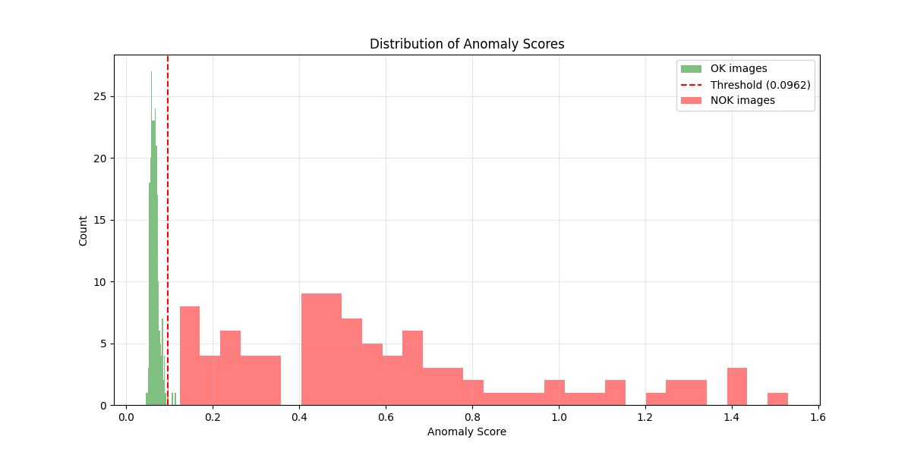
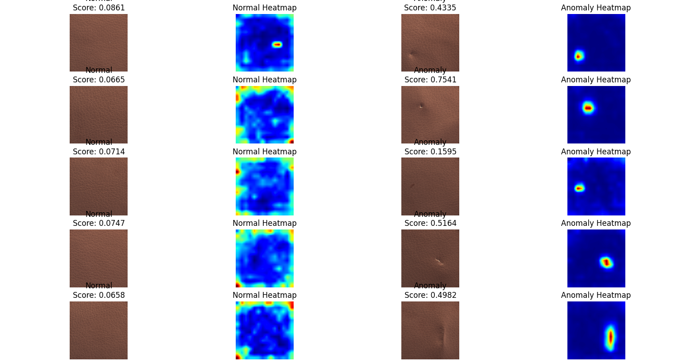
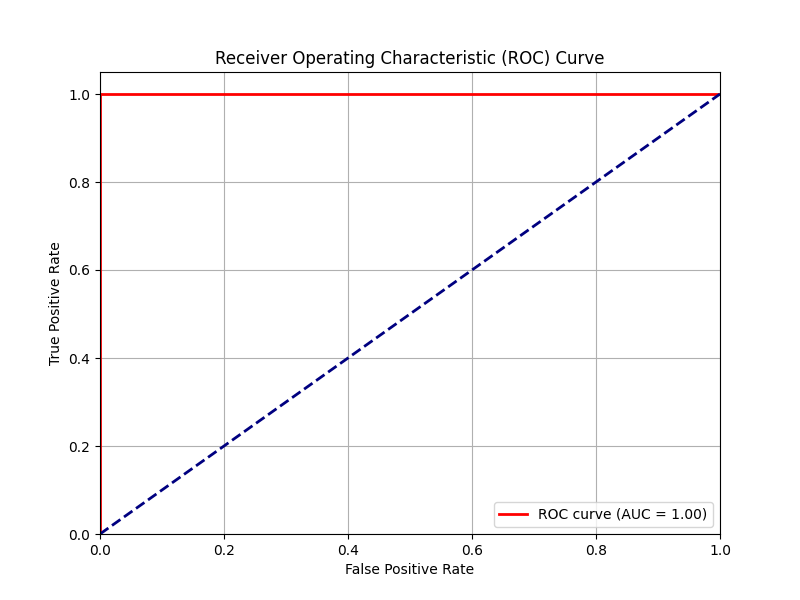
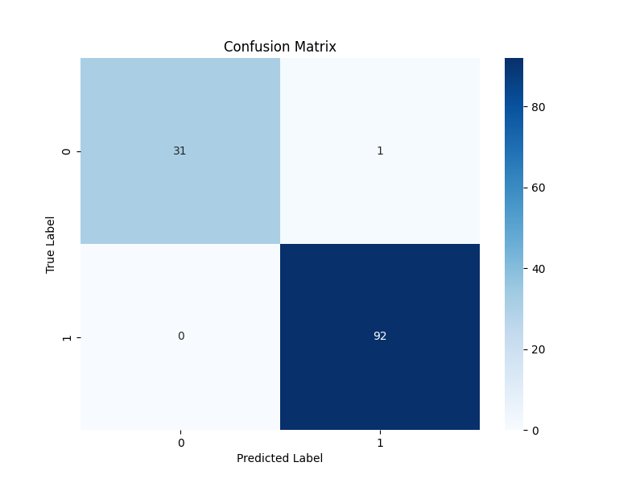
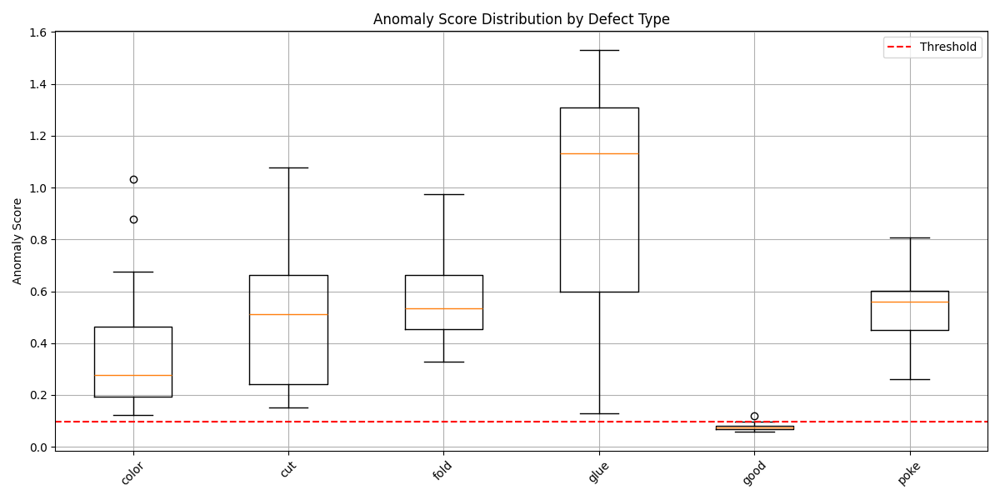

# Anomaly Detection using ResNet-50 and AutoEncoders

Anomaly detection is critical in industrial applications, such as quality control in manufacturing, where identifying defects or irregularities in products is essential. This project leverages pre-trained CNN features (ResNet-50) and a simple autoencoder architecture to detect anomalies in textured surfaces, using the Leather dataset.

---

## Overview

This project uses **ResNet-50** as a feature extractor combined with a lightweight autoencoder for anomaly detection. The main idea is to train the autoencoder to reconstruct normal data (defect-free textures). Anomalous textures result in higher reconstruction errors, which are used as the basis for detection.

---

## Features

- **Feature Extraction**: Utilizes ResNet-50 pre-trained on ImageNet for effective feature representation.
- **Autoencoder Architecture**: Lightweight and efficient, designed for reconstruction tasks.
- **Visualization Outputs**: Includes reconstruction error heatmaps, ROC curve, and anomaly score distribution.
- **Configurable Thresholds**: Adjust thresholds to fine-tune the sensitivity of anomaly detection.

---

## Installation

1. Clone the repository:
   ```bash
   git clone https://github.com/BaliBot2/anomaly_detection.git
   cd anomaly_detection
   ```

2. Install the required dependencies(Ideally in a venv):
   ```bash
   pip install -r requirements.txt
   ```

3. Ensure you have the necessary dataset (e.g., MVTec dataset). The leather dataset of the MVTec is already included in the repo.
4. ```bash
   python torchtest.py
   ```
   To figure out if GPU is active or not (GPU would decrease runtime)

---

## Usage

1. **Training the Model**:
   ```bash
   python Anomaly_Detection_model.py
   ```
   This script trains the autoencoder using the features extracted from ResNet-50.

2. **Visualizing Results**:
   ```bash
   python Anomaly_visualizations.py
   ```
   The script automatically generates outputs, including ROC curves, confusion matrix, and anomaly score distributions.

4. **Custom Predictions**:
   Modify `Anomaly_Detection_model.py` to input custom images for prediction and anomaly score calculation.

---

## Methodology

1. **Data Preprocessing**:
   - Images resized to `224x224` pixels.
   - Normalization applied for feature extraction.

2. **Feature Extraction**:
   - ResNet-50 Layer 3 features are used for effective representation.
   - Output dimension: `(batch_size, 1024, height, width)`.

3. **Autoencoder Architecture**:
   - **Encoder**: Reduces feature dimensions to a bottleneck representation.
   - **Decoder**: Reconstructs the original feature space.

4. **Decision Function**:
   - Computes anomaly scores by averaging the top 10 highest reconstruction errors.
   - Threshold is set using the 3-sigma rule:
     
     ```
     Threshold = Mean(normal_scores) + 3 * StdDev(normal_scores)
     ```

---

## Results

- **ROC AUC Score**: 1.000
- **Accuracy**: 98.81%
- **Precision**: 95.83%
- **Recall**: 100.00%

These metrics demonstrate the effectiveness of the model in distinguishing normal and anomalous samples.

## Visualizations

### 1. Distribution of Anomaly Scores


### 2. Heatmap Visualizations


### 3. ROC Curve

*Perfect Score*

### 4. Confusion Matrix


### 5. Anomaly Score Distribution by Defect Type


